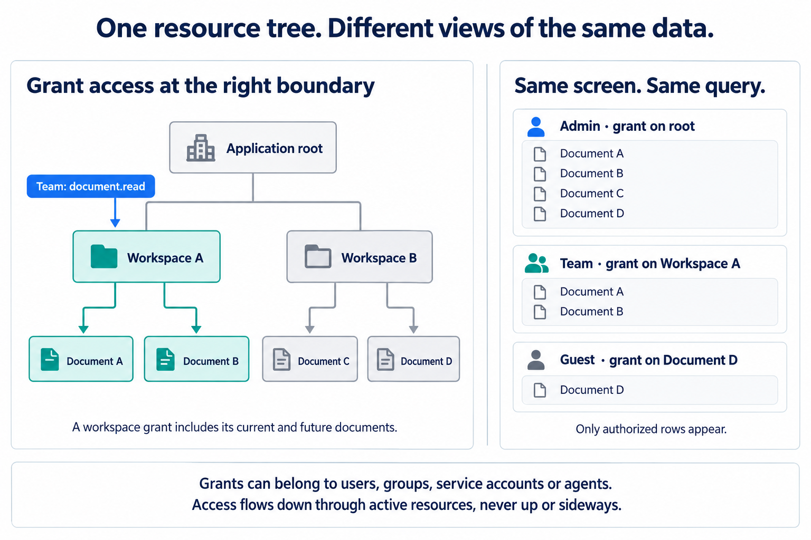

# SqlOS

**Authentication and authorization for .NET applications, running in your process and your SQL Server or PostgreSQL database.**

[](LICENSE)
[](https://www.nuget.org/packages/SqlOS)
[](https://dotnet.microsoft.com)

SqlOS gives your application hosted sign-in, enterprise SSO, organizations, sessions, an admin dashboard, and fine-grained authorization that filters EF Core queries in SQL. You own the accounts and data, and run the infrastructure.

Working copies of the one-app host, MCP + authorization, branding, and identity-provider setups are in the [hosting quick reference](docs/QUICK_REFERENCE.md).

## Build one screen for every role

A company administrator, a team member, and an outside collaborator can use the same endpoint and see different records. SqlOS's **scoped hierarchical role-based access control (SHRBAC)** models resources as a tree and gives `BuildFilterAsync` the job of finding the rows each caller may access.



For a document editor, create a workspace when someone signs up and grant them a role containing `document.read` on it. Place their documents underneath. New documents inherit access automatically; you do not create another grant for every document. Grant a team access through a group, or share an individual document with a guest. Users, groups, service accounts, and agents use the same model.

```csharp
var canRead = await authorization.BuildFilterAsync<Document>(subjectId, "document.read");
var documents = await db.Documents
    .Where(canRead)
    .OrderBy(d => d.Name).ThenBy(d => d.Id)
    .Take(21)
    .ToListAsync();
```

The endpoint needs no `where tenantId` or `where userId` to discover authorized records across the caller's grants. Add those conditions when the screen itself is scoped to a tenant or owner. Declare the page's compound index (`HasIndex(d => new { d.Name, d.Id })`); SqlOS uses database filtering and ordering while coordinating the authorized page. Point checks protect individual actions and writes.

### Design the hierarchy around access

- **Grant where access belongs.** Workspace → document, team → inspection → item, or department → case → record. Choose the highest node that matches the intended access. A grant covers the relevant descendants, including new ones; do not broaden access just to make queries faster.
- **Use groups for shared responsibilities.** One group grant replaces duplicate grants for its members. Use direct grants for individual shares. Membership or ownership alone does not grant access.
- **A caller's independent branches still matter.** Reading across 100 separately granted projects requires discovering and merging those branches. That cost follows this caller's access, including their groups, rather than scanning all unrelated application rows. A root grant or one workspace grant has a very different shape.
- **Indexes buy faster reads with storage and write work.** SqlOS maintains ancestry, grant counts, direct-grant indexes, and an index per tree level for each declared page order. It does not store every sorting permutation or every caller's complete visible dataset. Updating a directly shared row's indexed fields also updates its direct-grant entries.
- **Keep large reorganizations deliberate.** Moving or deactivating a branch changes inheritance and refreshes descendant state. Large subtree changes can block concurrent writes.
- **One API does not mean every query has the same cost.** Supported indexed pages avoid loading the complete grant list first. Counts, joins, unsupported page shapes, unindexed sorts, and selective filters retain their normal database costs; the predicate fallback resolves access roots. There is no universal page-sized-work guarantee for arbitrary queries.

SqlOS uses temporary application memory for candidate keys and sort values while building a page; SQL Server or PostgreSQL performs the comparisons and filtering. There is no external policy service or full-table application-side filtering.

Derive protected entities from `SqlOSResourceEntity`: the base class supplies `ResourceId` and the managed `FgaScope` property. SqlOS adds no other columns to your application tables. SQL Server's supporting scope indexes live in SqlOS-owned tables; PostgreSQL uses expression indexes. Your normal EF model and application migrations remain the definition of your application columns.

→ **[Designing your resource tree and its tradeoffs](https://sqlos.dev/docs/fga/designing-your-resource-tree)** · [Authorize EF Core queries](https://sqlos.dev/docs/quickstarts/ef-authorization) · [Page shapes and indexes](https://sqlos.dev/docs/guides/paginating-authorized-lists)

The retail sample uses the same endpoints for both callers:

<table>
  <tr>
    <td width="50%" valign="top">
      <p><strong>Company Admin</strong> — five chains visible</p>
      
    </td>
    <td width="50%" valign="top">
      <p><strong>Store Clerk</strong> — one store, filtered in SQL</p>
      
    </td>
  </tr>
</table>

## Authentication and identity

### 1. An auth server

A full OAuth 2.0 authorization server and OpenID Connect Provider mounted inside your app: authorization code + PKCE, refresh tokens, device flow, client credentials, discovery, ID tokens, UserInfo, and a consent screen for third-party clients — verified against the OpenID Foundation conformance suite in CI.

Sign-in methods are configuration, not projects: passwords, email OTP, magic links, SMS, social login (Google, Microsoft, GitHub, Apple, any OIDC provider), SAML enterprise SSO, SCIM directory sync, and TOTP MFA. B2B primitives — organizations, memberships, invitations, per-application access rules — are built in. Other apps can even use yours as their identity provider ([Sign in with X](https://sqlos.dev/docs/guides/sign-in-with-x)).

<p align="center">
  
</p>

<p align="center">
  
</p>

→ [Auth server overview](https://sqlos.dev/docs/authserver/overview) · [OpenID Provider](https://sqlos.dev/docs/authserver/openid-provider) · [Organizations](https://sqlos.dev/docs/authserver/organizations)

### 2. AuthPage — hosted login UI

Login, signup, OTP entry, MFA, organization selection, and consent ship as hosted pages, ready on day one. Brand them with your name, logo, and colors — from code seeds, the Admin API, or the dashboard — and the same identity carries into the built-in OTP, invitation, and password-reset emails.

<p align="center">
  
</p>

→ [Brand hosted auth and email](https://sqlos.dev/docs/guides/auth-branding) · [Hosted vs. headless](https://sqlos.dev/docs/authserver/hosted-vs-headless)

### 3. Headless auth — bring your own UI

If the hosted pages don't fit your product, keep SqlOS as the protocol engine and draw every screen yourself: `app.Headless("/auth/authorize")` in the one-call setup, or `AuthServer.UseHeadlessAuthPage` on a multi-app host. Your frontend talks to a typed state machine — login, signup, OTP, MFA, consent — while SqlOS still owns OAuth, PKCE, sessions, and tokens. Extra signup fields, A/B tests, and native-feeling popups all become your UI's decisions.

<p align="center">
  
</p>

→ [Build your own login and signup UI](https://sqlos.dev/docs/guides/custom-login-ui) · [Headless auth reference](https://sqlos.dev/docs/guides/custom-login-ui)

## See it running in 2 minutes

The Todo sample gives you a working login flow and authorized EF Core queries without touching your own code:

```bash
dotnet run --project examples/SqlOS.Todo.AppHost/SqlOS.Todo.AppHost.csproj
```

Then open `http://localhost:5090/`. The Aspire AppHost starts PostgreSQL, the Todo API with SqlOS at `http://localhost:5080`, and a Razor Pages client at `http://localhost:5090`. Set `SqlOS:DatabaseProvider=SqlServer` to start SQL Server instead.

<p align="center">
  
</p>

[Todo sample walkthrough](https://sqlos.dev/docs/quickstarts/run-todo) · [Hosting quick reference](docs/QUICK_REFERENCE.md) · [All documentation](https://sqlos.dev/docs)

## Contributing

```bash
dotnet build SqlOS.sln
./scripts/unit-tests.sh
./scripts/integration-tests.sh
./scripts/docs-check.sh
```

SqlOS is MIT licensed. Issues and pull requests are welcome.
