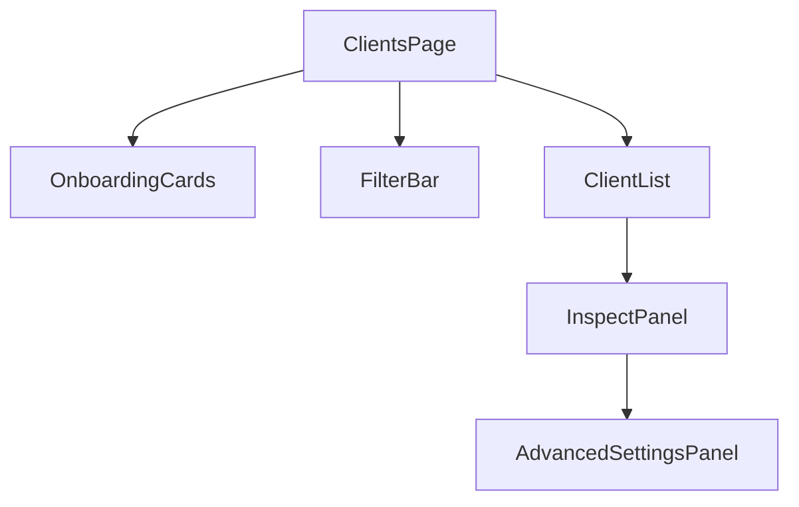

# SqlOS Client Registration DevEx 2026

This note defines the approved developer-experience model for client registration,
MCP OAuth, dashboard UX, and SDK abstractions before implementation work begins.

The goal is simple:

- make SqlOS feel obvious for owned apps
- make SqlOS feel modern for portable MCP clients
- keep ChatGPT and VS Code compatibility reachable
- keep every low-level setting available when advanced users need it

## Product Goal

SqlOS should feel like:

- the easiest way to add auth for your own app
- the clearest way to expose an auth server for MCP-era clients
- a system that speaks plain product language first and standards language second

The product should not force most developers to think in terms of `DCR`,
`CIMD`, `RFC 7591`, or `resource indicators` on day one.

Those concepts remain visible and configurable, but they should appear in
advanced panels, inspect views, and focused docs.

## Market Read

As of Mar 2026, the practical reality is:

- classic auth platforms still feel like "register your app once"
- MCP auth introduces many third-party public clients
- standards direction is moving toward `CIMD`
- real client behavior is still mixed, especially for `ChatGPT` and `VS Code`

That means SqlOS should not ask developers to choose between protocols first.
It should ask what they are building, then map that choice to the right runtime
shape underneath.

## Primary Personas

1. Owned app developer
Wants to sign users into a normal `web`, `mobile`, or `native` app with the
fewest possible decisions.

2. MCP server developer
Wants public-client interoperability and needs SqlOS to work with modern agent
clients without deep OAuth archaeology.

3. Compatibility-focused integrator
Has a specific goal like "make ChatGPT work" or "make VS Code work" and wants
safe defaults for those clients now.

4. Operator/admin
Needs to inspect, disable, filter, and support many clients across seeded,
manual, discovered, and dynamically registered sources.

5. Advanced integrator
Wants full control over every validation rule, cache setting, trust policy,
registration mode, and token detail.

## Approved Vocabulary

Use these terms consistently across dashboard, SDK, docs, and samples.

### Primary product language

- `Owned app`
  - Use for first-party `SPA`, `web`, `mobile`, `native`, and controlled
    internal apps.
  - This is the default story.

- `Portable MCP client`
  - Use for public third-party clients that need to identify themselves to many
    servers.
  - This is the public interoperability story.

- `Compatibility client`
  - Use when a real client still depends on `DCR` behavior today.
  - This keeps the product language user-centered instead of standards-centered.

- `Discovered client`
  - Use for `CIMD` clients in the dashboard and docs.
  - Avoid leading with "cache-backed discovered client" in primary copy.
  - Use the more detailed phrase in inspect/details and operator docs.

- `Registered client`
  - Use for `DCR` clients in the dashboard and operator docs.

### Secondary standards language

These terms remain important, but only after the user chooses the higher-level
path:

- `CIMD`
- `DCR`
- `resource indicator`
- `token_endpoint_auth_method`
- `registration_endpoint`

### Source vocabulary

Persisted source values stay technical:

- `seeded`
- `manual`
- `cimd`
- `dcr`

UI labels should be humanized:

- `Seeded`
- `Manual`
- `Discovered`
- `Registered`

## Approved Mental Model

SqlOS has three product lanes:

1. Owned apps
- easiest path
- preregistered or seeded clients
- normal PKCE flow
- no need to think about MCP unless desired

2. Portable MCP clients
- `CIMD` first
- public-client onboarding without manual preregistration
- resource indicators treated as first-class

3. Compatibility clients
- `DCR` when a real client still needs it
- public-client-only
- stronger lifecycle controls and cleanup

## Dashboard Information Architecture

Keep a single top-level auth navigation item: `Clients`.

Do not split `Owned Apps`, `CIMD`, and `DCR` into separate nav sections. That
would force protocol knowledge too early and fragment the operator view.

Instead, structure the `Clients` page like this:



### Default page sections

1. Onboarding cards
- `Add owned web app`
- `Add owned mobile or native app`
- `Enable portable MCP clients`
- `Enable ChatGPT compatibility`
- `Enable VS Code compatibility`
- `Advanced setup`

2. Filter bar
- `All`
- `Owned`
- `Discovered`
- `Registered`
- `Disabled`
- search input

3. Client list
- sortable, pageable
- source badge
- status badge
- last seen
- primary identifier
- trust/risk hints where relevant

4. Inspect panel or detail page
- summary
- source and lifecycle
- metadata and redirect URIs
- resource/audience behavior
- recent activity and audit trail
- operator actions

5. Advanced settings panel
- raw protocol fields
- trust-policy options
- cache settings
- rate-limit settings
- low-level metadata snapshot

### Default list columns

- `Name`
- `Client ID`
- `Type`
- `Source`
- `Status`
- `Last seen`
- `Audience or resource mode`

### Badge model

- Source badge:
  - `Seeded`
  - `Manual`
  - `Discovered`
  - `Registered`

- Status badge:
  - `Active`
  - `Disabled`
  - `Cache stale`
  - `Review needed`

- Experience badge:
  - `Owned app`
  - `Portable MCP`
  - `Compatibility`

The experience badge is derived from preset/profile, not persisted as the
source-of-truth.

## Dashboard Onboarding Model

The first question should be:

`What are you connecting?`

Not:

`Which OAuth registration mechanism do you want?`

### Approved onboarding presets

1. `Owned SPA / Web`
2. `Owned Native / Mobile`
3. `Portable MCP Client`
4. `ChatGPT Compatibility`
5. `VS Code Compatibility`
6. `Advanced / Custom`

### Preset behavior

Presets should:

- prefill safe defaults
- explain what SqlOS will configure
- show one-sentence warnings when relevant
- allow the user to expand advanced fields

Presets should not:

- hide the raw settings forever
- create a parallel model that can drift from the real runtime configuration

## Preset-to-Settings Mapping

| Preset | Primary Story | Underlying Model |
| --- | --- | --- |
| `Owned SPA / Web` | First-party browser app | Seeded/manual client, PKCE required, audience fallback allowed, `CIMD`/`DCR` not required |
| `Owned Native / Mobile` | First-party mobile or desktop app | Seeded/manual public client, PKCE required, native redirect guidance, audience fallback allowed |
| `Portable MCP Client` | Public interoperability | `CIMD` enabled, resource indicators on, trust policy visible, `DCR` optional/off by default |
| `ChatGPT Compatibility` | Make current ChatGPT work | `DCR` enabled, resource indicators on, public-client-only, rate limiting and audit on |
| `VS Code Compatibility` | Make current VS Code work | `DCR` enabled, resource indicators on, loopback redirect validation emphasized |
| `Advanced / Custom` | Full control | Direct access to all fields and policies |

## Approved SDK Abstraction Model

The SDK/config surface should follow the same progression:

1. Simple intent-first helpers
2. Fluent configuration for common public-client scenarios
3. Full low-level property access

### Layer 1: simple helpers

These should be the first examples shown in docs:

```csharp
builder.AddSqlOS<AppDbContext>(options =>
{
    options.AuthServer.SeedOwnedWebApp(
        "my-app",
        "My App",
        "https://app.example.com/auth/callback");
});
```

```csharp
builder.AddSqlOS<AppDbContext>(options =>
{
    options.AuthServer.SeedOwnedNativeApp(
        "my-mobile-app",
        "My Mobile App",
        "myapp://auth/callback");
});
```

### Layer 2: intent-first public-client configuration

```csharp
builder.AddSqlOS<AppDbContext>(options =>
{
    options.AuthServer.EnablePortableMcpClients(mcp =>
    {
        mcp.UseCimd();
        mcp.RequireResourceIndicators();
    });
});
```

```csharp
builder.AddSqlOS<AppDbContext>(options =>
{
    options.AuthServer.EnableChatGptCompatibility(compat =>
    {
        compat.EnableDynamicClientRegistration();
        compat.RequireResourceIndicators();
    });
});
```

### Layer 3: raw settings

```csharp
builder.AddSqlOS<AppDbContext>(options =>
{
    options.AuthServer.ClientRegistration.Cimd.Enabled = true;
    options.AuthServer.ClientRegistration.Cimd.DefaultCacheTtl = TimeSpan.FromHours(12);
    options.AuthServer.ClientRegistration.Cimd.TrustPolicy = ctx => Task.FromResult(true);

    options.AuthServer.ClientRegistration.Dcr.Enabled = true;
    options.AuthServer.ClientRegistration.Dcr.AllowLoopbackRedirects = true;
    options.AuthServer.ResourceIndicators.Enabled = true;
});
```

This layering preserves power while keeping the common path readable.

## SDK Naming Rules

- Prefer action-oriented names:
  - `EnablePortableMcpClients`
  - `EnableChatGptCompatibility`
  - `SeedOwnedWebApp`
  - `SeedOwnedNativeApp`

- Avoid leading with jargon in helper names:
  - avoid `EnableCimdPublicClientDiscoveryForMcp`
  - avoid `ConfigureRfc7591Compatibility`

- Keep low-level namespaces explicit:
  - `ClientRegistration.Cimd`
  - `ClientRegistration.Dcr`
  - `ResourceIndicators`

## Progressive Disclosure Rules

### Default UI should show

- what the user is building
- what SqlOS will do for them
- whether the setup is best for owned apps, portable clients, or compatibility
- the minimum required fields to succeed

### Advanced UI should show

- raw OAuth metadata fields
- trust allowlists/denylists
- token auth method details
- metadata cache state
- rate limits
- stored raw metadata

### Inspect view should show

- everything the operator needs to debug
- including the exact source and raw metadata snapshot

Do not make the inspect view identical to the create flow.

## Copy Style Rules

- Lead with `what to do`, not `what RFC this comes from`
- Prefer `owned app`, `portable MCP client`, and `compatibility` in headlines
- Use `CIMD` and `DCR` in subheadings, advanced panels, and operator views
- Avoid saying `manual registration` when `add owned app` is clearer
- Avoid saying `cache-backed discovered client` in top-level UI copy
- Use short warnings:
  - `Discovered from client metadata. Edit trust settings instead of changing redirect URIs here.`
  - `Registered dynamically for compatibility. Review lifecycle and cleanup settings if this list grows quickly.`

## Approved UX for Discovered and Registered Clients

### Discovered clients

- inspectable
- disableable
- filterable
- not directly editable in ways that change identity
- metadata freshness must be visible

### Registered clients

- inspectable
- disableable
- filterable
- duplicate/fingerprint hints visible
- cleanup eligibility visible

### Seeded and manual clients

- fully manageable
- clearest path for owned apps
- remain the default examples in onboarding and quick start docs

## Required User Journeys to Validate

Before locking the implementation model, validate that the proposed abstractions
feel natural for these journeys:

1. Add hosted auth to a first-party web app
2. Add auth to a first-party mobile/native app
3. Make a local preregistered localhost client work
4. Enable a public portable client via CIMD
5. Enable ChatGPT compatibility via DCR
6. Enable VS Code compatibility via DCR
7. Inspect and disable a discovered client
8. Audit and clean up stale registered clients

## Approved Output of This Note

This note approves the following implementation direction:

- one `Clients` area in the dashboard
- onboarding based on user intent
- progressive disclosure for advanced fields
- helper methods for common paths
- raw settings still available directly
- `CIMD-first`, `DCR-compatible`, `preregistration-friendly`
- docs and samples that start with owned hosted auth, then branch into MCP paths

If later implementation work conflicts with this note, update the code to match
the note unless there is a strong technical reason to revise the note itself.
