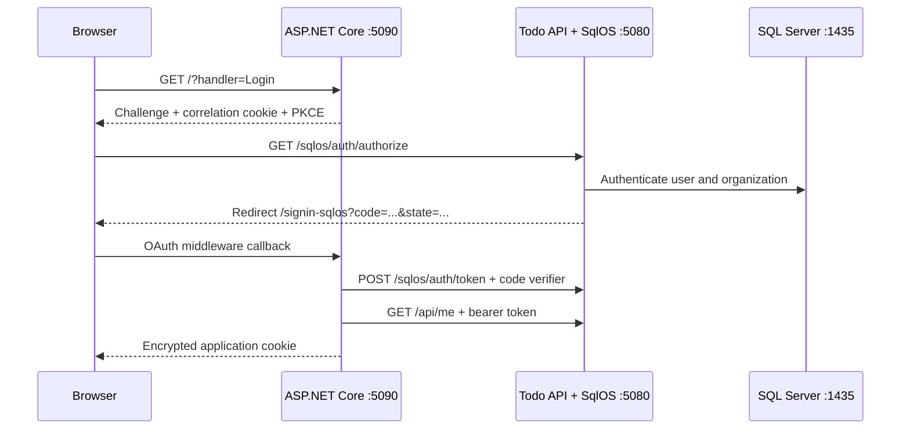

# ASP.NET Core web client

This Razor Pages application is the shortest end-to-end .NET login example in the repository. It uses ASP.NET Core's built-in authentication middleware—there is no JavaScript auth SDK and no custom callback controller.

The sample proves the complete lifecycle:

- redirect to the SqlOS hosted AuthPage;
- authorization code flow with PKCE and protected correlation state;
- code exchange on the server;
- claims loaded from a protected API;
- an encrypted, HTTP-only ASP.NET Core session cookie;
- authenticated API calls with the issued access token;
- refresh-token rotation before an access token expires;
- refresh-token and session revocation during sign-out.

## Run it

Prerequisites:

- .NET 9 SDK;
- Docker Desktop or another Docker-compatible runtime;
- free local ports `1435`, `5080`, `5090`, `18890`, and `18891`.

From the repository root, start the Todo AppHost:

```bash
dotnet run --project examples/SqlOS.Todo.AppHost/SqlOS.Todo.AppHost.csproj
```

The AppHost starts SQL Server, the Todo API/SqlOS host, and this Razor Pages client. Wait for its resources to become healthy, then open `http://localhost:5090` and select **Sign in with SqlOS**.

The terminal also prints an authenticated Aspire dashboard link. Its configured listener is `https://localhost:18890`; use the printed URL because it can include a local dashboard token.

On the hosted page, create a password user and organization or sign in with a user already stored in the persistent sample database. After the callback, the page shows:

- the current user, organization, client, and token expiry;
- the exact JSON returned by authenticated `GET /api/me`;
- a sign-out action that revokes the SqlOS refresh token and session before clearing the local cookie.

## What talks to what



The Todo host seeds `example-aspnet` as a first-party public PKCE client with:

| Contract | Local value |
| --- | --- |
| Authorization endpoint | `http://localhost:5080/sqlos/auth/authorize` |
| Token endpoint | `http://localhost:5080/sqlos/auth/token` |
| Redirect URI | `http://localhost:5090/signin-sqlos` |
| Resource/audience | `http://localhost:5080/api/todos` |
| Scopes | `openid profile email offline_access todos.read todos.write` |

Redirect URIs are exact. `/signin-sqlos` belongs to ASP.NET Core authentication middleware; it is not a Razor Page and should not be mapped as one.

## Code tour

| File | Responsibility |
| --- | --- |
| [`Program.cs`](Program.cs) | Cookie and OAuth handlers, PKCE, endpoints, scopes, and claim mapping |
| [`Pages/Index.cshtml.cs`](Pages/Index.cshtml.cs) | Challenge, authenticated API call, token display, and revoking logout |
| [`Pages/Index.cshtml`](Pages/Index.cshtml) | Signed-out flow explanation and signed-in proof UI |
| [`wwwroot/site.css`](wwwroot/site.css) | Responsive sample presentation with no frontend build step |
| [`../SqlOS.Todo.Api/Program.cs`](../SqlOS.Todo.Api/Program.cs) | Public-client registration and protected Todo resource |
| [`../SqlOS.Todo.AppHost/Program.cs`](../SqlOS.Todo.AppHost/Program.cs) | SQL, API, and client orchestration |

The important middleware configuration is intentionally standard ASP.NET Core:

```csharp
builder.Services
    .AddAuthentication(options =>
    {
        options.DefaultScheme = CookieAuthenticationDefaults.AuthenticationScheme;
        options.DefaultChallengeScheme = "SqlOS";
    })
    .AddCookie()
    .AddOAuth("SqlOS", options =>
    {
        options.ClientId = "example-aspnet";
        // Required by ASP.NET Core's generic OAuth handler; this public PKCE
        // client does not use it as a confidential-client credential.
        options.ClientSecret = "public-pkce-client";
        options.CallbackPath = "/signin-sqlos";
        options.AuthorizationEndpoint = $"{sqlosOrigin}/sqlos/auth/authorize";
        options.TokenEndpoint = $"{sqlosOrigin}/sqlos/auth/token";
        options.UsePkce = true;
        options.SaveTokens = true;
    });
```

ASP.NET Core's generic OAuth handler requires a non-empty `ClientSecret` property. The complete sample supplies the literal `public-pkce-client` only to satisfy that API. SqlOS ignores it for this public client and authenticates the exchange with PKCE; the literal is not a secret and must not be mistaken for confidential-client authentication.

`OnCreatingTicket` calls the Todo API's protected `/api/me` endpoint with the new access token. It maps the returned subject, organization, client, email, and session ID into the application identity before ASP.NET Core creates the cookie. That makes the trust boundary visible: application claims come from a bearer-authenticated resource, not browser input.

## Configuration

The client reads normal ASP.NET Core configuration:

| Key | Default | Purpose |
| --- | --- | --- |
| `SqlOS:Origin` | `http://localhost:5080` | Public origin of the SqlOS/Todo host |
| `SqlOS:ClientId` | `example-aspnet` | Seeded public OAuth client |

The AppHosts inject these values as `SqlOS__Origin` and `SqlOS__ClientId`. If you change the client port, callback path, origin, or resource audience, change both the OAuth client and its SqlOS registration.

## Production decisions to make

This is executable reference code, not a complete session-management product. Before adapting it to a deployed application:

- require HTTPS and set both session and correlation cookies to `CookieSecurePolicy.Always`;
- persist ASP.NET Core Data Protection keys in a shared durable store when more than one instance serves the app;
- keep the exact redirect URI allow-listed and keep the client public only when PKCE is required;
- decide whether application claims should be copied at login, refreshed per request, or resolved from your own profile store;
- store OAuth tokens server-side with `ITicketStore` or another session/token store when cookie size or token exposure is a concern;
- coordinate access-token refresh when several concurrent requests can renew the same rotating refresh token; the sample performs one refresh from a page request and renews its authentication ticket;
- define what happens when remote revocation is unavailable. This sample logs the failure and still clears the local application session.

`SaveTokens = true` keeps the flow easy to inspect by placing tokens in the encrypted authentication ticket. That is convenient locally, but it can produce a large browser cookie with several tokens and claims.

## Troubleshooting

### `invalid_redirect_uri`

Use `http://localhost:5090/signin-sqlos` exactly. The scheme, host, port, and path must match the seeded client.

### Correlation or state validation fails

Do not open a callback URL manually or reuse an old callback. Start a fresh challenge from `http://localhost:5090`. SqlOS schema version 27 widens stored OAuth state for ASP.NET Core's protected state payload; let the Todo host complete schema initialization before signing in.

### The app returns to the page without a session

Inspect the Todo API and `aspnet-web` logs in Aspire. The callback also calls `/api/me`; an audience, scope, or API failure intentionally prevents creation of an incomplete local identity.

### Old users or clients remain after restart

The Todo AppHost uses a persistent SQL container and data volume. Stopping the process does not erase identity or FGA state. Remove the disposable Todo container/volume or drop its sample database only when you intentionally want a clean start.

## Build it separately

The project has no package dependencies beyond the ASP.NET Core shared framework:

```bash
dotnet build examples/SqlOS.Example.AspNetCoreWeb/SqlOS.Example.AspNetCoreWeb.csproj
```

Running the project alone still requires the Todo host at the configured origin. For the guided version of this flow, read [Sign in an ASP.NET Core app](https://sqlos.dev/docs/quickstarts/aspnet-core-login).
